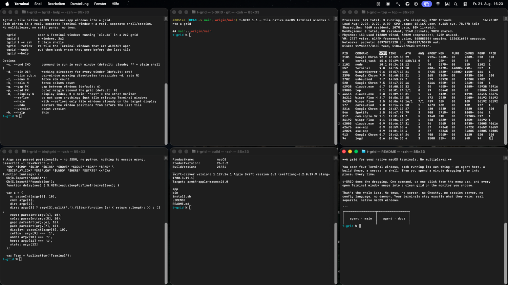

# t-GRID

**Two ways to arrange your native macOS terminals. No multiplexer.**

You open four Terminal windows, each running its own thing — an agent here, a
build there, a server, a shell. Then you spend a minute dragging them into
place. Every time.

t-GRID does the dragging. One command, or one click from the menu bar, and every
open Terminal window snaps into a clean grid on the monitor you choose.



*Six real Terminal.app windows, six separate shells, one command: `tgrid 6`.*

That's the whole idea. No tmux, no screen, no Ghostty, no session server, no
config language, no daemon. Your terminals stay exactly what they were: real,
separate, native macOS windows.

---

## Why this exists

Terminal.app has a **Split Pane** feature (⌘D). It does not do what almost
everyone assumes it does.

Splitting a Terminal pane gives you *a second view of the same session*. Type in
the bottom half and the top half types too — because it is the same shell. It's
a split of the scrollback, not a split of the process. Terminal.app has no real
split sessions and never has.

So on macOS, **one session means one window**. Which is fine — until you have six
of them scattered across two monitors like playing cards.

The usual answers are to give up the native terminal (tmux, a different terminal
emulator) or to install a system-wide tiling window manager that rearranges
*every* app you own. Both are large moves for a small problem.

t-GRID is the small move.

---

## Install

Requires macOS 13+ and the Xcode Command Line Tools (for the optional menu bar
app only — the CLI needs nothing but bash).

```sh
git clone https://github.com/ali2407/t-GRID.git
cd t-GRID
./install.sh
```

`install.sh` puts `tgrid` on your `PATH` and offers to build the menu bar app.
Nothing else is touched — no login items, no launch agents, no `sudo`.

To remove it: delete the symlink it made, delete `~/Applications/TGrid.app`, and
delete the folder. There is no uninstaller because there is nothing to uninstall.

---

## The CLI

```sh
tgrid --reflow           # tile the Terminal windows that are already open
tgrid                    # open 4 new windows in a 2×2, each running `claude`
tgrid 6                  # 6 windows, 3×2
tgrid 2 -c zsh           # 2 plain shells instead
tgrid --reflow --theme   # ...and give every cell its own colour and a clean title
tgrid --deck             # one window centred, the rest peeking in at the edges
tgrid --next             # swipe the deck along
tgrid --undo             # put everything back where it was
```

Everything else:

| Flag | Meaning |
|---|---|
| `-c, --cmd CMD` | command to run in each new window (default `claude`; `""` = plain shell) |
| `-d, --dir DIR` | working directory for every new window |
| `--dirs a,b,c` | one directory per window — a window per project |
| `-r, --rows N` | force the row count |
| — | left alone, the grid picks the shape: 1, 1×2, 2×2, 2×3, 2×4, 2×5, 3×4 |
| `-k, --cols N` | force the column count |
| `-g, --gap PX` | gap between windows (default 6) |
| `-p, --pad PX` | outer margin around the whole grid |
| `-D, --display N` | which monitor — `0` is main, `next` is the other one |
| `--reflow` | tile what's already open instead of opening anything |
| `--here` | with `--reflow`: only windows already on the target monitor |
| `--undo` | restore the positions from before the last tile |
| `-t, --theme` | colour each cell, strip the title bar, fit the font to the cell |
| `--plain` | undo that — put the windows back on your default profile |
| `--font PT` | font size for `--theme` (default: fitted to the cell) |
| `--deck` | one window centred, the others peeking in from the edges |
| `--next` / `--prev` | move the deck one window along |
| `--main PCT` | width of the centred window, % of the screen (default 58) |
| `--peek PX` | how much of the nearest side window stays visible (default 150) |
| `--glass` | translucent windows with a blurred backdrop (softens the text) |
| `--reprofile` | rebuild t-GRID's profiles after changing the look |

A few combinations worth knowing:

```sh
tgrid --reflow -D next            # throw the whole grid onto the other monitor
tgrid --reflow --here -D 1        # tidy monitor 2 without disturbing monitor 1
tgrid --dirs ~/api,~/web,~/infra  # three projects, three windows, one command
tgrid 8 -r 2 -k 4 -g 0            # dense 2×4, no gaps
tgrid --reflow --theme            # tidy up and style what's already open
```

Set `TGRID_THEME=1` in your shell profile if you want `--theme` to be the default.

---

## Two views

**The grid** shows you everything at once. Good when you're supervising — six
agents running, and you want to catch the one that stopped.

**The deck** is the other half of the day: one session has your attention, the
rest should be one keystroke away and otherwise out of the way. The focused
window floats in the middle; the others are parked at the left and right screen
edges with a strip showing, and you swipe along with `--next` / `--prev`.

Everything stays on **one display**, and nothing is resized. The obvious way to
park a card at the edge is to push it off the edge — which is wrong on any
machine with a second monitor, because the hidden 80% of that window does not
vanish, it lands on the next screen along. Resizing the cards to fit is worse: a
narrow Terminal reflows the agent UI inside it, and these are live sessions.

The way out is that a card hidden *behind the centred one* looks exactly like a
card hanging off the screen — you cannot see either part. So a parked card sits
flush with the display edge and extends **inward**, behind the middle card. Same
picture, nothing off-screen, nothing resized. Cards further back step in from
the edge so each shows a little less than the one in front.

```sh
tgrid --deck            # centre whatever is frontmost, park the rest
tgrid --next            # bring the next window to the middle
tgrid --prev            # and back
tgrid --deck --main 70  # give the centred window more of the screen
tgrid --deck --peek 220 # let more of the side windows show
```

The order is a **ring** kept between runs, so `--next` walks the same sequence
every time instead of jumping to whatever happens to be frontmost. Windows that
you close drop out of it; new ones join the end. `--undo` still puts everything
back.

Both views are the same windows and the same sessions. Only the arithmetic
changes — switch between them as often as you like.

---

## The terminal design

Six tiled terminals have a problem tiling alone doesn't fix: they are six
identical dark rectangles, and the only glanceable text on them is a title bar
that reads

```
albert — ◑ 100k integration plan files — caffeinate ◂ claude — 116×43
```

The part you actually want is in the middle. `--theme` deals with both.

**Solid, and deliberately so.** t-GRID can make the windows translucent with a
blurred backdrop — `--glass` — and it looks good in a screenshot. It is off by
default because macOS switches off subpixel antialiasing for any window that is
not opaque: it cannot blend subpixels against a backdrop it cannot see. Terminal
text goes visibly soft, and it is all-or-nothing — 99% opacity looks exactly as
soft as 70%. Glass is lovely on a card you glance at. This is a wall of text you
read all day.

**Every cell gets its own ground.** A near-black tinted with one of eight
accents, and a cursor in that accent. Text stays the same neutral grey in every
window, so reading never changes; the colour is spent on the background — which
you only notice when a neighbour is beside it — and on the cursor, which is the
thing you hunt for. Bold stays neutral on purpose: tinting it would make a red
cell's headings look like errors. The palette alternates warm and cool rather
than running round the colour wheel, so no two neighbouring cells look alike.

**The title bar loses everything but the title.** `albert —` is the folder
proxy, `— -zsh` the running process, `— 116×43` the window size. What's left is
whatever the session put there — which for an agent is the task it's working on.
New windows are named `3 · myproject` on the way in, so a plain shell has
something to say too; anything that runs afterwards is free to overwrite it.

**The font fits the cell.** A 2×2 gets 16pt, a 3×2 gets 12, a 4×2 gets 9 — each
picked so the cell still holds about 100 columns. A dense grid gives you smaller
type instead of an agent UI clipped down the right-hand side. `--font 11` if you
disagree.

In the deck the accent follows the window's place in the **ring**, not where it
is standing right now — otherwise every swipe would repaint everything, which
destroys the one thing a colour is for.

t-GRID does this with Terminal profiles of its own, named `t-GRID 1` … `t-GRID
8`. Your own profiles are never touched, and `--plain` puts every window back on
your default. The look is baked into the profile when it is built, so after
changing `--glass` you need `--reprofile` to rebuild them.

---

## Nameplates

Terminal.app has no API for custom chrome, so nothing can draw a header *inside*
its window. What nothing stops you doing is putting a panel of your own *on top*
of one.

Turn on **Nameplates** in the menu bar app and every Terminal window gets a
small bar parked exactly over its title bar, between the traffic lights and
Terminal's own split button: an icon in the window's accent, the session name,
what's running in it, and a green dot while it's busy.

```
 ● ● ●   [✦] LANDING · claude                                          ●
```

The plate is **click-through**. That matters more than it sounds: the title bar
underneath keeps working, so the window still drags, double-click still zooms,
and nothing about Terminal behaves differently because there is a picture
floating over it.

It needs no extra permission. Window rectangles come from the public window list
— no screen recording, no accessibility — and the names come over the same
Apple Events the panel already uses. Geometry is followed 5×/second so a dragged
window doesn't leave its plate behind; names refresh once a second and a half,
because those cost an Apple Event and the name rarely changes.

Agents write a spinner glyph into their title (`✳ LANDING`). That glyph becomes
the plate's icon rather than being printed twice.

---

## The menu bar app

Optional, and the same thing with a face on it. `install.sh` builds it, or:

```sh
./app/build.sh          # → ~/Applications/TGrid.app
```

It lives in the menu bar and nowhere else — no Dock icon, no app switcher entry.
Click the grid symbol and you get:

- **Monitor** — your displays drawn to their real shape. Click one.
- **Layout** — hover a cell to sweep out a `3 × 2`, click to lock it, click the
  same cell again to go back to *Auto*.
- **Colour each cell, strip the title bar** — the checkbox next to the monitor.
  The same thing `--theme` does on the CLI.
- **Nameplates over the title bars** — the overlay described above.
- **Deck** with `‹ ›` — the deck view, and swiping it along.
- **Sort open terminals** — the button. Everything open, snapped into place.
- **New grid of N** — spawns that many fresh sessions, already tiled, in a
  folder you pick.
- **Sessions** — what's running, which monitor it's on, a green dot when it's
  busy. Click a row to bring that window to the front.
- **Undo** — for when you sort something you didn't mean to.

Your monitor, gap, layout and folder are remembered between launches.

On first use macOS will ask whether TGrid may control Terminal. It has to —
moving another app's windows *is* automation. Say yes, or the panel will show
you a link straight to the right settings pane.

---

## How it actually works

There is no magic here, and that's deliberate.

Terminal.app is scriptable. Every window has an `id` and a `bounds` rectangle
that can be **written**, not just read. t-GRID asks macOS for the usable area of
a display, divides it into cells, and tells Terminal:

> window `3440`, your rectangle is now `x=0 y=30 957×522`.

That is the entire mechanism. It's the same thing as dragging the window corner,
done by arithmetic instead of by hand. Nothing runs afterwards — no daemon
watching your windows, no compositor, no state. The windows are simply somewhere
else now, and they are still ordinary Terminal windows that know nothing about
t-GRID.

Which means: if t-GRID vanished from your disk right now, nothing about your
setup would break.

Two details that took real debugging, in case you're reading the source:

- **Windows are addressed by `id`, never by index.** AppleScript window
  references resolve lazily by position in the window list, and that list
  reshuffles as you move things — so index-based code cheerfully puts two
  windows in the same cell.
- **Every display reserves menu bar height**, not just the primary one. With
  "Displays have separate Spaces" enabled each screen has its own menu bar, but
  only the primary reports that inset in `visibleFrame`. Miss it and the bottom
  row of your grid hangs off the bottom of the second monitor.
- **Half of the title bar has no AppleScript switch.** Colours, font and four
  title flags are settable on a Terminal profile. The folder proxy and the
  process name are not — they exist only in the profile's plist, so setting
  every switch AppleScript exposes changes nothing you can see. A profile that
  hides them has to be *born* from a `.terminal` file. The useful part is that
  importing one registers a real profile, which can then be handed to windows
  that are already open.
- **`close()` on a window whose shell is still running does nothing.** Terminal
  puts up a confirmation sheet instead of failing, so the call reports success
  and the window stays. Exit the shell first, then close.

Picking a layout in the menu bar app is a request for that many slots: **Sort
opens the windows the grid is short of** and then tiles the full set. Four
windows and a 2x3 gives you six, not four spread across six cells with the last
row stretched. On Auto the grid follows the window count instead, and nothing
is opened.

Windows are tiled in **reading order of where they already are** — top-left to
bottom-right, the way you would tidy a desk. Each window moves to the nearest
cell rather than to a slot decided somewhere else, so tiling straightens your
layout instead of reshuffling it, and sorting twice gives you the same result
twice.

Ordering by window id was tried first. It is just as stable, but ids follow
creation order, which has nothing to do with what you see — so tidying up flung
sessions across the screen and looked random.

---

## Limits, honestly

- **macOS and Terminal.app only.** iTerm2, Ghostty, WezTerm and friends are not
  supported. They mostly have their own splits that work properly.
- Terminal snaps window sizes to whole character cells, so a window can land a
  pixel or two off its computed rectangle.
- Minimized windows are skipped.
- The layout is a one-shot arrangement, not a managed tiling mode. New windows
  you open afterwards land wherever Terminal puts them until you sort again.
- **Nameplates need the app running.** They are drawn by TGrid.app, so they
  live and die with it. The CLI alone cannot draw anything on screen.
- No global hotkey yet, so `--next` needs the menu bar app or a shell alias.
- `--theme` styles the window, not the session. Colours follow the cell, so a
  window that moves cells changes colour — they name a position in the grid,
  not a project.
- The first themed run builds one Terminal profile per accent, and importing a
  profile costs a window that opens and closes again. It takes a few seconds,
  once.

---

## License

MIT. Do what you like with it.
